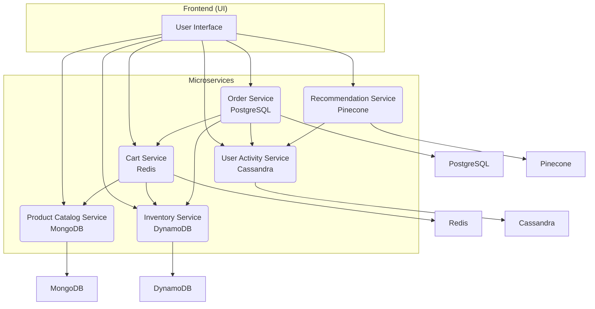
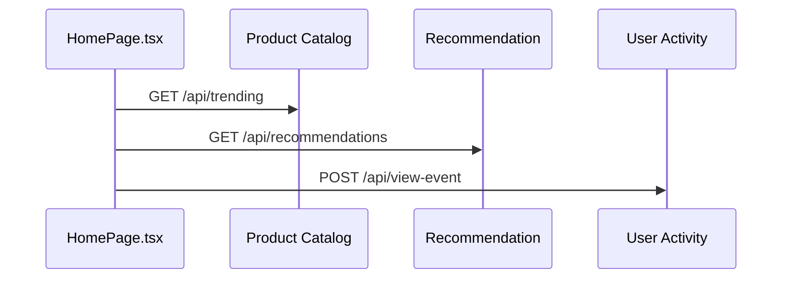
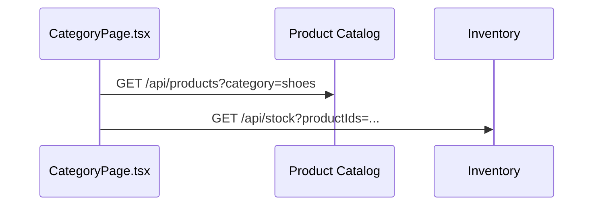
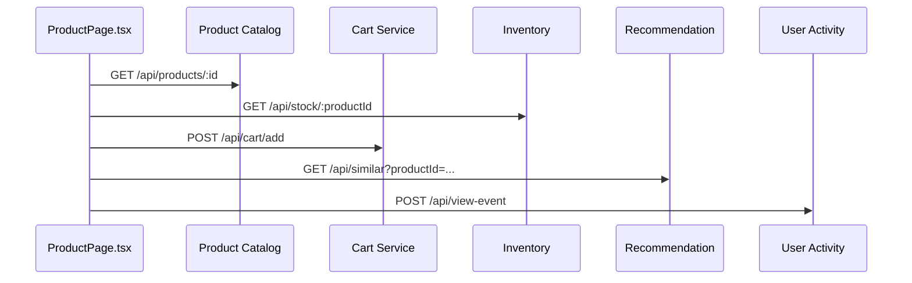
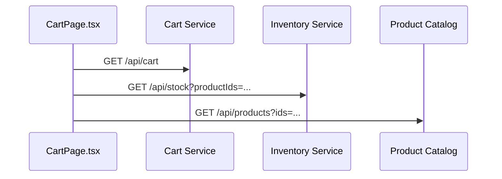
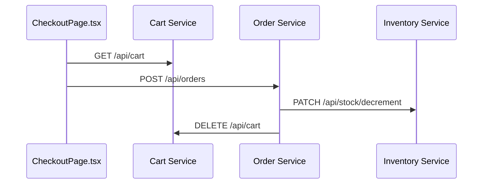
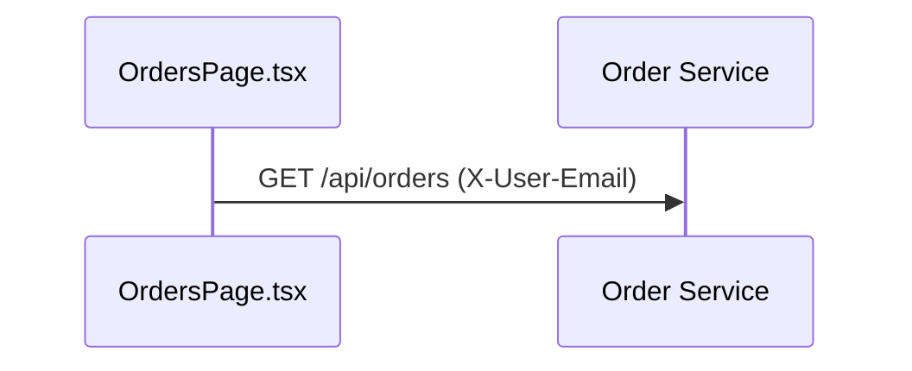
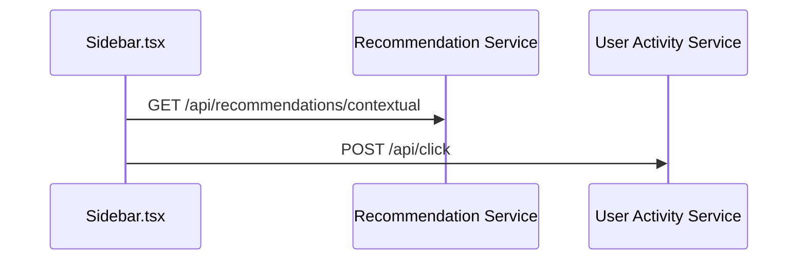

# 🧩 User Story: Seamless Shopping Experience on an AI-Powered E-Commerce Platform

### As an

**online shopper** seeking a personalized, intuitive, and fast experience,

### I want to

**browse flexible product listings, receive personalized recommendations, manage my cart in real-time, and checkout instantly**

### So that

**I can enjoy a convenient and intelligent shopping journey that feels tailor-made for me.**

---

## 🛠️ Microservice Architecture Overview

---

## 🔍 Microservices & Their Purpose

### 🛒 **Order Service** (PostgreSQL)

* Handles placing and tracking of user orders.
* Supports address, payment, item list, and total.
* ACID-compliant and relational for strong consistency.
* Interacts with Cart, Inventory, and User Activity.

---

### 📦 **Inventory Service** (DynamoDB)

* Manages real-time product stock per region/location.
* Designed for high throughput and low-latency writes.
* Enables instant stock checks and updates after purchases.

---

### ⚡ **Cart Service** (Redis)

* Manages temporary user shopping carts.
* In-memory store with TTL (30 min expiration).
* Ultra-fast access and real-time updates.

---

### 📚 **Product Catalog Service** (MongoDB)

* Stores flexible product data: names, specs, variants, categories.
* Schema-less design for evolving product structures.
* Powers all product listings and detail pages.

---

### 📈 **User Activity Service** (Cassandra)

* Logs user interactions: clicks, views, navigation.
* Built for append-only high-volume write scenarios.
* Used for analytics and feedback to recommendation engine.

---

### 🧠 **Recommendation Service** (Pinecone)

* Provides vector-based product similarity search.
* Uses OpenAI embeddings to compute product vectors.
* Returns personalized results based on user behavior.

---

## 🔄 UI → API Interaction (Mermaid Diagrams)

### 🏠 Home Page

---

### 🛍️ Product Listing Page

---

### 📄 Product Detail Page

---

### 🛒 Cart Page

---

### 💳 Checkout Page

---

### 🧑 My Orders Page

---

### 🧠 Recommendation Panel

---

## 📦 Microservices and Their Databases (Quick Reference)

| Microservice            | Database   | Description                                                  |
| ----------------------- | ---------- | ------------------------------------------------------------ |
| Order Service           | PostgreSQL | Transactions, relationships (users, products, payments)      |
| Inventory Service       | DynamoDB   | Regional stock management, fast writes                       |
| Cart Service            | Redis      | Temporary cart storage with TTL                              |
| Product Catalog Service | MongoDB    | Flexible, nested product structures                          |
| User Activity Service   | Cassandra  | Time-series logs, clickstream, behavior tracking             |
| Recommendation Service  | Pinecone   | Vector search via AI embeddings for personalized suggestions |

